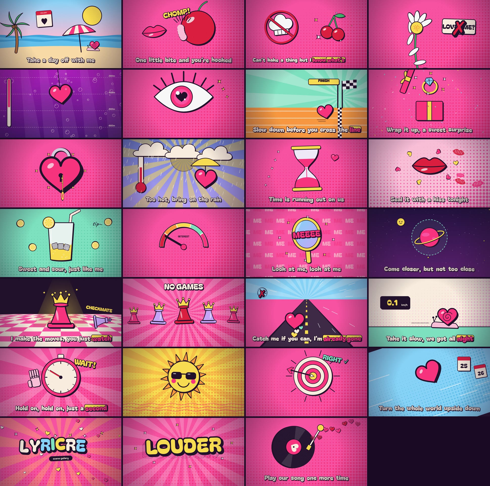

<div align="center">

# lyricreel

**Song + lyrics in, beat-synced lyric music video out. Every frame is drawn in code.**

**English** · [繁體中文](README.zh-TW.md)


<sub>The bundled demo project: an original synthesized track with made-up lyrics.</sub>

</div>

## What is this?

lyricreel turns an audio file and its lyrics into a 1080p lyric video in a bold pop-art sticker style:

- **Listens to the song.** Finds BPM and beats, and follows loudness and bass. The camera pulses on the kick, choruses shake, and the screen flashes on the beat.
- **Finds when each word is sung.** Uses Whisper word timestamps and a monotonic sequence alignment against your lyrics, so repeated choruses don't get mixed up. You can pin any line by hand.
- **Draws a scene for every line.** There are 27 hand-coded Canvas scenes (a chess queen, a sinking heart, lemonade, a stopwatch, …). Pick one per line, or write your own in a few lines of JavaScript.
- **Types the lyrics in time.** Words pop in as they're sung, the active word gets a sticker highlight, ad-libs in parentheses appear in handwriting, and long lines shrink to stay on one row. CJK lyrics are split per character.
- **Renders deterministically.** Headless Chrome draws each frame and ffmpeg encodes it. The same input always gives the same video.

It is designed to be driven by an AI coding agent (Claude Code, Codex). Hand it a song and lyrics, and [AGENTS.md](AGENTS.md) tells it how to plan scenes, write new ones, render review stills and fix what looks wrong. It works just as well by hand.

## Scene library



Full list with descriptions: [docs/SCENES.md](docs/SCENES.md). Regenerate it with `lyricreel gallery`.

## Requirements

- Node.js 18+, ffmpeg, Google Chrome or Chromium
- Python 3.10+ for audio analysis and transcription (librosa, openai-whisper)

```bash
git clone https://github.com/malilion/lyricreel && cd lyricreel
npm install
python3 -m venv .venv && .venv/bin/pip install -r requirements.txt
npm link            # optional: puts `lyricreel` on your PATH (otherwise use `node bin/lyricreel.js`)
```

## Try the demo (30 seconds, no vocals needed)

```bash
lyricreel build examples/demo --no-asr     # analyze beats + align the pinned lyrics
lyricreel preview examples/demo            # open the printed URL, press Play
lyricreel render examples/demo             # → examples/demo/out/LYRICREEL.mp4
```

## Make your own

```bash
lyricreel new projects/my-song --audio ~/Music/my-song.mp3 --title "MY SONG" --artist "Me"
# edit projects/my-song/script.txt (see below)
lyricreel build projects/my-song           # analyze + Whisper + align
lyricreel preview projects/my-song
lyricreel stills projects/my-song 12,34.5,61
lyricreel render projects/my-song
```

`projects/` is gitignored, so your songs and lyrics stay on your machine.

### script.txt

One lyric line per row:

```
# section | scene[:arg]   | lyric (ad-libs in parentheses)       | @start (optional)
intro     | title         | Hey, it's lyricreel                  | @1.0
chorus1   | sun           | Shining like a summer song (so bright)
chorus1   | lemonade      | Sweet as lemonade
post1     | mirror:ME     | Me, me, me
bridge    | typo:DROP     | Here comes the drop
```

- **section** sets the background palette and energy. `chorus`, `post`, `verse`, `pre`, `bridge`, `intro` and `outro` each have a look; a trailing number is allowed (`chorus2`). The last chorus gets a "finale" palette and confetti. An empty section keeps the previous one.
- **scene** is any name from the library, or from your project's `scenes/` folder. `:arg` overrides the scene's text (see the `arg` column in SCENES.md). An empty scene means `typo`.
- **ad-libs** are backing vocals in parentheses, shown in handwriting next to the line.
- **@start** pins the line's start time in seconds. `lyricreel align` marks estimated lines with `~`; watch the preview and pin the ones that are off.

### project.json

```json
{
  "title": "MY SONG",
  "artist": "Me",
  "audio": "song.mp3",
  "whisper": { "model": "small", "language": "en", "refine": [[0, 20]] },
  "palette": { "pink": "#ff6fb5" },
  "sections": { "verse": ["#fff3e3", "#ffc2dc"] },
  "interlude": "title",
  "lyrics": true
}
```

| key | meaning |
|---|---|
| `whisper.model` | `tiny` … `large-v3`; `small.en` is a good default for English |
| `whisper.language` | `null` = auto-detect; set it (`"ko"`, `"zh"`, `"ja"` …) for better results |
| `whisper.refine` | time ranges to transcribe again with the lyrics as a prompt (dense intros and outros) |
| `palette` | override any engine color (`ink pink hot cherry lemon cream sky mint lilac orange blush`) |
| `sections` | override background `[base, dots]` colors per section type |
| `interlude` | scene shown in instrumental gaps longer than 3.2s |
| `lyrics` | `false` hides the lyric typography (visuals only) |

### Writing a scene

Drop a file in `projects/my-song/scenes/` (project only) or `engine/scenes/` (whole library):

```js
scene('rocket', {"desc":"A rocket launches on the drop","fits":"launch, flying, rising","arg":"label","demo":"Up, up and away"}, s => {
  secBg(s);                                     // section-colored halftone background
  const y = lerp(900, -200, eIn(s.p));          // s.p: 0→1 over the scene
  ctx.save(); ctx.translate(960, y); ctx.scale(1 + s.b * .1, 1 + s.b * .1);   // s.b: beat pulse
  sticker(rrP(120, 300, 60), C.hot);            // ink-outlined sticker shape with drop shadow
  ctx.restore();
  stext(s.arg || 'LIFT OFF', 960, 200, 120, C.lemon);
});
```

The scene gets `s = { t, lt, p, dur, b, bass, e, sec, line, arg }` and paints the full 1920×1080 frame; lyrics are drawn on top automatically. The helpers are in [engine/core.js](engine/core.js): easing, `hash` for deterministic randomness, `sticker`, `stext`, heart, star, lips and sparkle shapes, halftone, rays, confetti and bubble backgrounds.

Rules: stay **deterministic** (use `hash()`, never `Math.random()` or `Date`), and draw the whole frame every time.

## How it works

```
song.mp3 ─► analyze.py ──► build/audio.json   (beats, rms, bass @30fps)
         └► transcribe.py ► build/asr.json    (Whisper word timestamps)
script.txt + both ─► align.py ─► build/timeline.js
engine/player.html + scenes + timeline.js ─► headless Chrome renderAt(t) ─► ffmpeg ─► mp4
```

## Commands

| command | does |
|---|---|
| `new <dir> [--audio f] [--title] [--artist]` | scaffold a project |
| `analyze <dir>` | beats / BPM / energy |
| `transcribe <dir> [--model] [--lang] [--refine a-b,…]` | Whisper word timestamps |
| `align <dir>` | lyric timeline; prints which lines are ASR-matched, pinned or estimated |
| `build <dir> [--no-asr]` | all three steps above |
| `preview <dir> [--port]` | local player with audio and a scrubber |
| `stills <dir> t1,t2,… [--out]` | export review frames |
| `render <dir> [--from] [--to] [--fps] [--crf] [--out]` | final mp4 |
| `scenes [--md]` / `gallery [--scene name]` | browse the scene library |

## Notes

- Whisper word timestamps can segfault on Python 3.13 with numba's JIT; `transcribe.py` sets `NUMBA_DISABLE_JIT=1` for you.
- Rendering runs at roughly 10 frames per second on an 8-core Mac, so a 3-minute song takes about 8–10 minutes.
- **Copyright:** only use audio and lyrics you have the rights to, and don't commit them. `projects/` is gitignored for this reason. The engine, scenes and demo in this repo are original.

## License

Code: [MIT](LICENSE). Fonts in `engine/fonts/` (Bagel Fat One, Space Grotesk, Caveat) are under the [SIL Open Font License](engine/fonts/).
